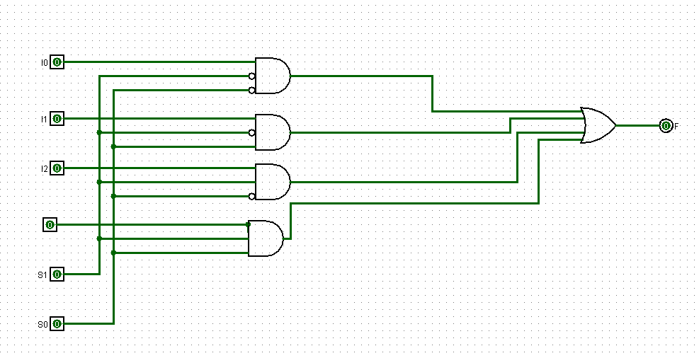

# calculadora_logisim

**Interface principal**

**Introdução**

Este relatório apresenta os detalhes de construção do projeto de uma calculadora digital capaz de realizar operações entre dois números hexadecimais de um único dígito, variando de 0 a F. O sistema foi projetado para explorar circuitos lógicos combinacionais, utilizando componentes eletrônicos como displays de 7 segmentos, circuito somador, decodificadores, multiplexador, subtratores e um decodificador inverso.

**Objetivo**

O objetivo deste projeto é criar uma calculadora digital intuitiva para inserir dois números hexadecimais por meio de LEDs e displays de 7 segmentos, permitindo a realização de soma, subtração, multiplicação e possuindo um circuito comparador.

**Componentes utilizados**

**Multiplexador 4x1**

O circuito multiplexador possui 4 entradas,1 saída e 2 bits de seleção. Sua função principal é receber múltiplas entradas e, com base nos bits de seleção, escolher uma delas para transferir à saída.

Diagrama esquemático
fonte: playlist de circuitos

fonte: 

**Circuito somador**

O circuito somador permite a realização de operações de adição sendo essencial para a conclusão do projeto.

1 passo: implementar um meio somador de 2 entradas a e b usando portas lógicas

2 passo: somador completo*
Utiliza dois meio somadores e uma porta OR, com 3 entradas (a,b,c) e duas saídas (S e Ci) 

3 passo: somador de 4 Bits*

Utiliza o meio somador e 4 somadores completos sendo que o meio somador já vai estar presente.

CIRCUITO SOMADOR DE 4 BITS

TESTES

**Comparador de magnitude**

O comparador de magnitude é utilizado para comparar dois números binários e determinar a relação entre eles. Ele verifica se um número é maior, menor ou igual ao outro. O comparador possui duas entradas com a mesma quantidade de bit onde vai indicar se A>B, A=B, A<B para suas entradas a e b de n bits.

se os números forem iguais A=B=1 e os outros são 0.
se A>B=1 e os outros são 0 
se A<B=1 e os outros 0

CIRCUITO COMPARADOR

 **Circuito subtrator**

O subtrador foi feito com meio somadores e somadores completos, no modelo somador/subtrador controlado, porém com uma alteração em sua estrutura para realizar somente a operação de subtração. verdade, mas ao invés do mapa de karnaugh, foi utilizado a soma de produtos para obter as expressões lógicas do circuito.

CIRCUITO DO SUBTRATOR

**Decodificador inverso**

O Decodificador Inverso foi feito baseado no decodificador para display de 7 segmentos pois é basicamente o inverso do mesmo. Foi utilizado a tabela 

CIRCUITO DO DECODIFICADOR INVERSO

**Decodificador de 7 segmentos**
 
Para o decodificador de 7 segmentos foi utilizado a tabela verdade e o mapa de karnaugh para a obtenção das expressões lógicas do circuito. Recebe um número binário e exibe o número hexadecimal no display de 7 segmentos, de 0 a F.

CIRCUITO DO DECODIFICADOR 

